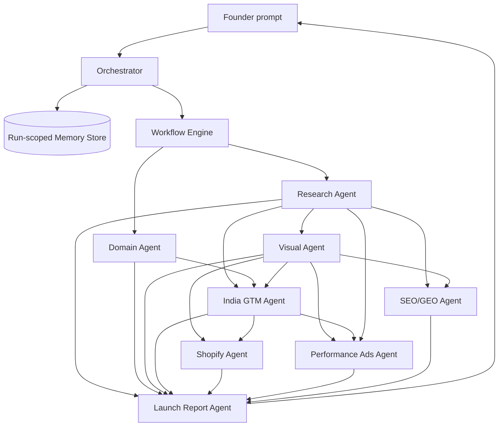

# Technical Design Document

Approved inputs verified:
- `PRD.md`
- `0.SCOPE.md`

Assumptions:
1. The system is a prototype built for a single launch run at a time, with run-scoped isolation.
2. The shared memory layer can use Mem0 or a compatible local store with the same read and write contract.
3. External integrations may be stubbed if they preserve the approved interface and deterministic outputs.

## 1. High-Level Architecture



The orchestrator owns the run, clarification timing, and progress visibility. The workflow engine schedules agents according to dependency order. Each agent reads from and writes to shared memory before the next dependent step begins.

## 2. Major Components and Responsibilities

1. **Orchestrator**
   - Accepts the founder prompt.
   - Starts the run-scoped memory record.
   - Collects clarification questions before expensive work starts.
   - Publishes status after each agent completes.
   - Satisfies `PRD-001`, `PRD-002`, `PRD-NFR-001`.

2. **Workflow Engine**
   - Enforces the dependency graph.
   - Runs Research and Domain in parallel.
   - Blocks downstream agents until required inputs exist.
   - Preserves partial completion state.
   - Satisfies `PRD-004`, `PRD-012`.

3. **Run-Scoped Memory Store**
   - Stores the approved shared schema.
   - Separates one launch run from another.
   - Validates reads and writes against schema shape.
   - Satisfies `PRD-003`, `PRD-NFR-002`.

4. **Specialist Agents**
   - Research, Visual, Domain, India GTM, Shopify, Performance Ads, SEO/GEO, and Launch Report each produce one bounded output.
   - Each agent only owns its own output domain.
   - Satisfy `PRD-005` through `PRD-012`.

5. **Delivery Package**
   - Bundles the runnable codebase, typed tool contracts, README, design document, and demo artifact.
   - Satisfies `PRD-013`.

## 3. Data Models

1. **Launch Run**
   - Run ID
   - Original founder prompt
   - Current status
   - Pending clarification questions
   - Completed agent outputs
   - Audit log

2. **Shared Memory Record**
   - `idea`
   - `research`
   - `visual`
   - `domains`
   - `gtm`
   - `shopify`
   - `ads`
   - `seo`
   - `audit_log`

3. **Agent Output Envelope**
   - Agent name
   - Output payload
   - Completion status
   - Timestamp
   - Keys written to memory

4. **Final Launch Bible**
   - Brand summary
   - Visual summary
   - Domain recommendation
   - GTM plan
   - Shopify package summary
   - Ads strategy
   - SEO/GEO plan
   - 90-day roadmap

## 4. API Contracts

1. **Start Run**
   - Input: founder prompt
   - Output: run ID, initial status, clarification questions if needed
   - Failure: empty or malformed prompt

2. **Read Memory**
   - Input: run ID, key
   - Output: schema-valid memory fragment
   - Failure: missing key, missing run, store unavailable

3. **Write Memory**
   - Input: run ID, key, structured payload
   - Output: write confirmation
   - Failure: schema mismatch, run mismatch, store unavailable

4. **Delegate Agent**
   - Input: agent ID, run ID, memory snapshot
   - Output: agent result and keys written
   - Failure: missing prerequisite data, agent execution error

5. **Get Status**
   - Input: run ID
   - Output: current step, completed steps, pending steps, failures
   - Failure: unknown run ID

## 5. Key Workflows and Sequences

1. **Run start**
   1. User submits one brand idea.
   2. Orchestrator validates the prompt.
   3. Orchestrator writes the idea to memory.
   4. Orchestrator asks all required clarification questions before expensive agents begin.

2. **Core execution**
   1. Workflow Engine starts Research and Domain in parallel.
   2. Research writes market context and keywords.
   3. Visual waits for Research, then writes brand identity output.
   4. GTM waits for Research, Domain, and Visual.
   5. Shopify waits for Visual and GTM.
   6. Ads waits for Research, Visual, and GTM.
   7. SEO/GEO waits for Research and Visual.
   8. Launch Report waits for all outputs.

3. **Sequence diagram for dependent completion**
```text
User -> Orchestrator: brand idea
Orchestrator -> Memory Store: write idea
Orchestrator -> Workflow Engine: start run
Workflow Engine -> Research Agent: execute
Workflow Engine -> Domain Agent: execute
Research Agent -> Memory Store: write research
Research Agent -> Visual Agent: release dependency
Visual Agent -> Memory Store: write visual
Visual Agent -> GTM Agent: release dependency
GTM Agent -> Memory Store: write gtm
Shopify Agent -> Memory Store: write shopify
Ads Agent -> Memory Store: write ads
SEO/GEO Agent -> Memory Store: write seo
Launch Report Agent -> Memory Store: write final bible
Launch Report Agent -> User: final output
```

## 6. Error Handling Strategy

1. Validate every prompt, memory read, and memory write before agent execution.
2. Fail fast when a required dependency is missing.
3. Preserve completed outputs if a later agent fails.
4. Mark the final report incomplete when prerequisite outputs are absent.
5. Surface agent failures in the status view without erasing earlier steps.
6. Treat missing shared memory data as a blocking error, not as a cue to re-ask already answered questions.

## 7. Scalability and Performance Considerations

1. The highest-cost work is isolated to agent execution, so parallelizing Research and Domain reduces wall-clock time.
2. Run-scoped memory prevents cross-run state bleed when multiple launches are active.
3. Stubbed external integrations keep demo latency predictable and reduce dependency risk.
4. The 10-minute NFR is met by limiting clarification rounds, bounding retries, and parallelizing independent work.
5. Chosen resolution for the latency versus security tension: prefer strong run isolation and schema validation, while keeping integrations stubbed and deterministic so the run still completes within the time budget.

## 8. Security Considerations

1. Reject oversized or malformed founder prompts.
2. Namespace every memory write by run ID.
3. Allow each agent access only to the tools it needs.
4. Validate URL and domain inputs before any external lookup.
5. Keep audit logs append-only for reviewability.
6. Do not persist secrets in shared memory.

## 9. Trade-offs and Alternatives Considered

1. **Shared memory backend**
   - Alternative A: Mem0
     - Pros: matches the approved scope directly; easier to explain memory compounding.
     - Cons: external dependency risk; harder to make fully deterministic in tests.
   - Alternative B: Local compatible store
     - Pros: deterministic; easier offline testing; lower operational risk.
     - Cons: diverges from the named product; less faithful to the target integration.
   - Chosen: compatible local store with the same API contract, with Mem0 as a swappable backend.

2. **Workflow topology**
   - Alternative A: Fully sequential
     - Pros: simplest to reason about; fewer orchestration edge cases.
     - Cons: slower; does not prove parallel execution; weaker demo quality.
   - Alternative B: DAG with selective parallelism
     - Pros: matches the approved dependency model; improves latency.
     - Cons: more orchestration complexity.
   - Chosen: DAG with parallel Research and Domain.

3. **Clarification handling**
   - Alternative A: Ask questions inside each agent
     - Pros: localized logic.
     - Cons: chatty experience; repeated pauses; harder to manage run flow.
   - Alternative B: Batch clarification at orchestrator start
     - Pros: fewer interruptions; keeps expensive work gated.
     - Cons: requires better upfront coordination.
   - Chosen: orchestrator-batched clarification.

4. **Integration strategy**
   - Alternative A: Live external APIs
     - Pros: more realistic outputs.
     - Cons: unstable demo risk; greater latency; more failure modes.
   - Alternative B: Typed stubs with realistic responses
     - Pros: deterministic; easier to test; fits the prototype scope.
     - Cons: lower fidelity than production integrations.
   - Chosen: typed stubs with realistic responses.

## 10. Traceability Matrix

| Component | Requirement IDs satisfied |
|---|---|
| Orchestrator | `PRD-001`, `PRD-002`, `PRD-NFR-001` |
| Run-Scoped Memory Store | `PRD-003`, `PRD-NFR-002` |
| Workflow Engine | `PRD-004`, `PRD-012` |
| Research Agent | `PRD-005` |
| Visual Agent | `PRD-006` |
| Domain Agent | `PRD-007` |
| India GTM Agent | `PRD-008` |
| Shopify Agent | `PRD-009` |
| Performance Ads Agent | `PRD-010` |
| SEO/GEO Agent | `PRD-011` |
| Launch Report Agent | `PRD-012` |
| Delivery Package and Documentation | `PRD-013` |

## 11. Explicit Non-Goals and Deferred Decisions

1. Production-grade external integrations are out of scope.
2. Live Shopify deployment is out of scope.
3. Real ad account activation is out of scope.
4. Multi-brand hosting and autoscaling are deferred.
5. Advanced interruption recovery beyond demoable partial completion is deferred.
6. UI polish is out of scope because the approved surface is CLI or HTTP only.

## 12. Threat Model

### STRIDE

1. **Spoofing**
   - Threat: a non-authorized component writes to memory as if it were an approved agent.
   - Mitigation: run-scoped authorization and typed agent ownership.

2. **Tampering**
   - Threat: a payload overwrites earlier memory values with invalid structure.
   - Mitigation: schema validation on every write plus append-only audit logs.

3. **Repudiation**
   - Threat: an agent output cannot be traced back to a completion event.
   - Mitigation: timestamped audit entries for every write.

4. **Information Disclosure**
   - Threat: one run can read another run’s memory.
   - Mitigation: strict namespace isolation by run ID.

5. **Denial of Service**
   - Threat: repeated clarification loops or oversized inputs block the workflow.
   - Mitigation: bounded prompt size, bounded clarification rounds, and execution timeouts.

6. **Elevation of Privilege**
   - Threat: an agent accesses a tool outside its approved scope.
   - Mitigation: per-agent tool allowlists and explicit dependency gates.

